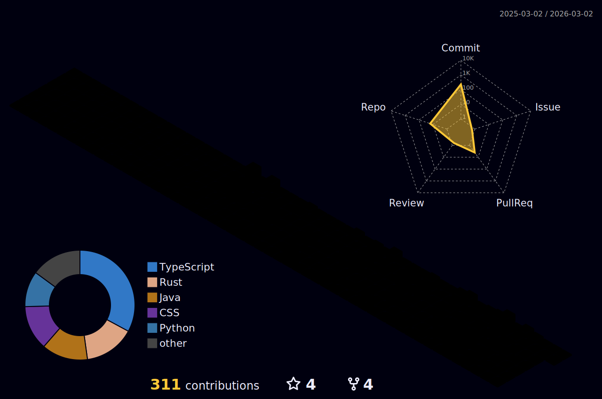

<h4 align="center">The Github repository for</h4>
<h1 align="center">ANTONY XAVIO IMMANUEL</h1>
<h4 align="center">A student developer, who lives his life as a hobby</h4>

  

- 🌱 I’m currently learning **Rust, Go, Docker, Kubernetes, AWS**

- 💬 Ask me about **Python, Algorithm**

- 📫 How to reach me **immanuel.2495@gmail.com**
<h1> </h1>

<h1> </h1>

  

<h3 align="left">Connect with me:</h3>

<h3 align="left">Languages and Tools:</h3>

                       

&nbsp;

