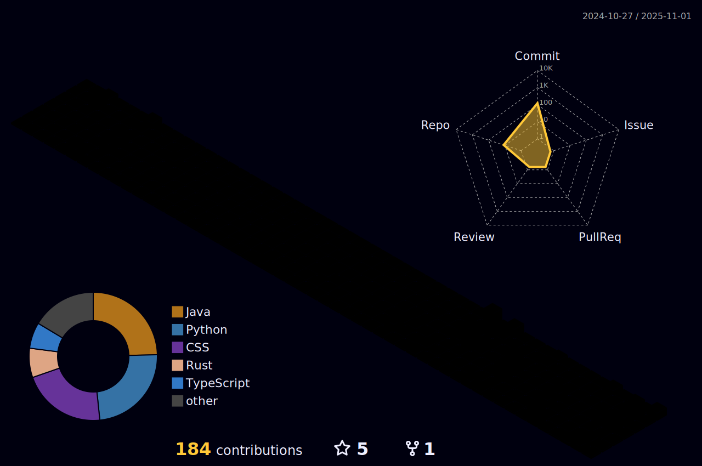

<h4 align="center">The Github repository for</h4>
<h1 align="center">ANTONY XAVIO IMMANUEL</h1>
<h4 align="center">A student developer, who lives his life as a hobby</h4>

  

- 🌱 I’m currently learning **Rust, Go, Docker, Kubernetes, AWS**

- 💬 Ask me about **Python, Algorithm**

- 📫 How to reach me **immanuel.2495@gmail.com**

